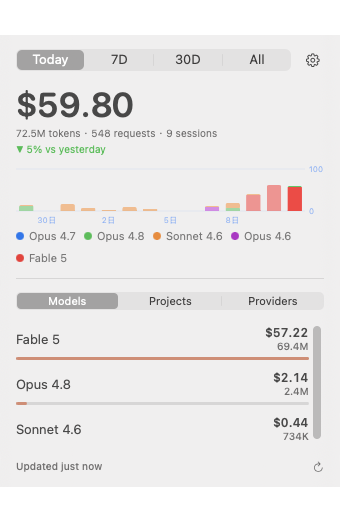

<div align="center">


# Tally

**Claude Code token usage and cost, live in your menu bar.**

[](https://github.com/a77ming/tally/releases)
[](https://swift.org)
[](LICENSE)
[](https://github.com/a77ming/tally/releases/latest)

English · [中文](#简体中文)

&nbsp;&nbsp;

</div>

---

Tally is a 100% native SwiftUI menu bar app for macOS (14+, Apple Silicon & Intel) that shows what your Claude Code sessions are actually costing you — at a glance, without leaving your desk or running a CLI. Fully local: zero network calls, no accounts, no telemetry.

## Features

- **Menu bar at a glance** — today's spend right in the menu bar. Switch to token count or icon-only if you prefer it quiet.
- **Refined popover** — click to open: a big spend number for the selected period (Today / 7D / 30D / All), a tokens · requests · sessions line, and a "vs yesterday" delta.
- **14-day cost chart** — stacked by model, drawn with Swift Charts.
- **Three breakdowns**:
  - **Models** — spend and tokens per model (Opus, Sonnet, Haiku, third-party models…).
  - **Projects** — which codebases are burning your budget.
  - **Providers** — if you use [cc-switch](https://github.com/farion1231/cc-switch) to hop between API providers (official Anthropic, MiniMax, Kimi, DeepSeek, relays…), Tally shows per-provider tokens and cost, each with its brand color and the active provider highlighted.
- **Accurate accounting** — reads Claude Code's own session logs, including cache read/write tokens, with request-id dedup and incremental parsing.
- **Real pricing** — uses cc-switch's 147-model pricing table when available, falling back to a built-in Claude price table. Unknown models still count tokens (priced at $0).
- **Settings** — menu bar display mode, refresh interval (30s / 1m / 5m), launch at login. Auto-refreshes on a timer, with manual refresh anytime.

## Install

1. Download the latest `.dmg` from [Releases](https://github.com/a77ming/tally/releases).
2. Drag **Tally** to **Applications**.
3. First launch: the app is unsigned, so macOS Gatekeeper will object. Either right-click the app → **Open**, or run:

```sh
xattr -cr /Applications/Tally.app
```

## Build from source

Requires only Xcode Command Line Tools — no Xcode, no Apple Developer account.

```sh
git clone https://github.com/a77ming/tally.git
cd tally
./Scripts/build-app.sh   # builds Tally.app
./Scripts/make-dmg.sh    # packages dist/Tally.dmg
```

## How it works

Tally reads two local data sources. Nothing ever leaves your machine.

| Source | What it provides | Required? |
|---|---|---|
| `~/.claude/projects/**/*.jsonl` | Claude Code's session logs: tokens (incl. cache read/write), model, project, session | Yes |
| `~/.cc-switch/cc-switch.db` | cc-switch's provider list, per-provider daily usage rollups, and its 147-model pricing table | Optional |

Without cc-switch, the Providers tab shows a hint and Tally uses its built-in Claude pricing — everything else works the same.

**Privacy:** local-only. Zero network calls, no accounts, no telemetry, ever.

## FAQ

**Does Tally read my API keys?**
No. It only parses Claude Code's `.jsonl` session logs and (optionally) cc-switch's usage and pricing tables. Keys, prompts, and responses are never touched.

**Does it work without cc-switch?**
Yes. You get everything except the per-provider breakdown; the Providers tab simply shows a hint, and built-in Claude pricing is used.

**Why is the app unsigned?**
Tally is free and open source, and signing requires a paid Apple Developer account. You can bypass Gatekeeper with right-click → Open (or the `xattr` one-liner above), or build from source yourself.

**Why don't my costs match my bill exactly?**
Tally computes cost from token counts × published per-model prices. Subscriptions (e.g. Claude Pro/Max), provider-side discounts, or unknown models (counted at $0) can make the real bill differ.

## Acknowledgements

Tally stands on the shoulders of three great projects:

- [ccusage](https://github.com/ryoppippi/ccusage) — the original Claude Code usage analyzer, CLI-first and excellent at it.
- [cc-bar](https://github.com/nanvon/cc-bar) — menu bar quota tracking for Codex accounts.
- [cc-switch](https://github.com/farion1231/cc-switch) — effortless provider switching for Claude Code; Tally happily reads its database to power the Providers tab.

ccusage is CLI-only, cc-bar tracks Codex quota, and cc-switch switches providers without visualizing usage — Tally aims to be the missing piece: a glanceable, multi-provider usage meter with native Apple design.

## License

[MIT](LICENSE) © 2026 a77ming

---

# 简体中文

<div align="center">

**Claude Code 的 token 用量与花费，实时显示在菜单栏。**

</div>

Tally 是一款 100% 原生 SwiftUI 的 macOS 菜单栏应用（macOS 14+，Apple Silicon 与 Intel 均支持），让你一眼看清 Claude Code 到底花了多少钱——不用开终端、不用跑 CLI。完全本地运行：零网络请求、无账号、无遥测。

## 功能

- **菜单栏一目了然** — 今日花费直接显示在菜单栏，也可切换为 token 数或纯图标模式。
- **精致的弹出面板** — 点击展开：所选周期（今天 / 7天 / 30天 / 全部）的大号金额数字、tokens · 请求数 · 会话数一行摘要、以及"对比昨天"的变化量。
- **14 天费用图表** — 按模型堆叠，由 Swift Charts 绘制。
- **三种维度拆分**：
  - **模型** — 每个模型（Opus、Sonnet、Haiku、第三方模型……）的花费与 token 数。
  - **项目** — 哪些代码库在消耗你的预算。
  - **供应商** — 如果你使用 [cc-switch](https://github.com/farion1231/cc-switch) 在多个 API 供应商之间切换（Anthropic 官方、MiniMax、Kimi、DeepSeek、中转站……），Tally 会按供应商展示 token 与费用，每个供应商带品牌色，当前激活的供应商高亮显示。
- **精确统计** — 直接读取 Claude Code 自身的会话日志，包含缓存读/写 token，按 request-id 去重，增量解析。
- **真实定价** — 优先使用 cc-switch 的 147 个模型定价表，无 cc-switch 时回退到内置 Claude 价格表。未知模型仍统计 token（按 $0 计价）。
- **设置** — 菜单栏显示模式、刷新间隔（30 秒 / 1 分钟 / 5 分钟）、开机自启。定时自动刷新，也可随时手动刷新。

## 安装

1. 从 [Releases](https://github.com/a77ming/tally/releases) 下载最新的 `.dmg`。
2. 把 **Tally** 拖进 **应用程序** 文件夹。
3. 首次启动：应用未签名，macOS Gatekeeper 会拦截。右键点击应用 → **打开**，或执行：

```sh
xattr -cr /Applications/Tally.app
```

## 从源码构建

只需要 Xcode Command Line Tools——不需要完整 Xcode，也不需要 Apple 开发者账号。

```sh
git clone https://github.com/a77ming/tally.git
cd tally
./Scripts/build-app.sh   # 构建 Tally.app
./Scripts/make-dmg.sh    # 打包 dist/Tally.dmg
```

## 工作原理

Tally 只读取两个本地数据源，任何数据都不会离开你的电脑。

| 数据源 | 提供什么 | 是否必需 |
|---|---|---|
| `~/.claude/projects/**/*.jsonl` | Claude Code 的会话日志：token（含缓存读/写）、模型、项目、会话 | 必需 |
| `~/.cc-switch/cc-switch.db` | cc-switch 的供应商列表、各供应商每日用量汇总、147 个模型的定价表 | 可选 |

没有 cc-switch 时，"供应商"标签页会显示提示，并使用内置 Claude 定价——其余功能完全一致。

**隐私：** 完全本地。零网络请求、无账号、无遥测。

## 常见问题

**Tally 会读取我的 API Key 吗？**
不会。它只解析 Claude Code 的 `.jsonl` 会话日志和（可选的）cc-switch 用量与定价表。Key、提示词和模型回复都不会被读取。

**不装 cc-switch 能用吗？**
能。除了按供应商拆分之外，其余功能全部可用；"供应商"标签页只会显示一条提示，定价使用内置 Claude 价格表。

**为什么应用没有签名？**
Tally 免费开源，而签名需要付费的 Apple 开发者账号。你可以通过右键 → 打开（或上面的 `xattr` 命令）绕过 Gatekeeper，也可以自己从源码构建。

**为什么费用和实际账单对不上？**
Tally 用 token 数 × 各模型公开单价计算费用。订阅套餐（如 Claude Pro/Max）、供应商折扣、或未知模型（按 $0 计）都可能导致与真实账单存在差异。

## 致谢

Tally 站在三个优秀项目的肩膀上：

- [ccusage](https://github.com/ryoppippi/ccusage) — 最早的 Claude Code 用量分析工具，CLI 形态且非常出色。
- [cc-bar](https://github.com/nanvon/cc-bar) — Codex 账号配额的菜单栏监控。
- [cc-switch](https://github.com/farion1231/cc-switch) — Claude Code 供应商一键切换；Tally 的"供应商"标签页正是基于它的数据库。

ccusage 只有 CLI，cc-bar 监控的是 Codex 配额，cc-switch 负责切换但不做用量可视化——Tally 想补上缺失的一块：一个原生苹果设计、支持多供应商、抬眼即见的用量仪表。

## 许可证

[MIT](LICENSE) © 2026 a77ming
