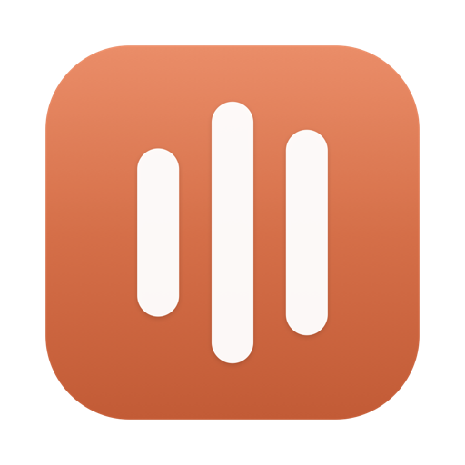
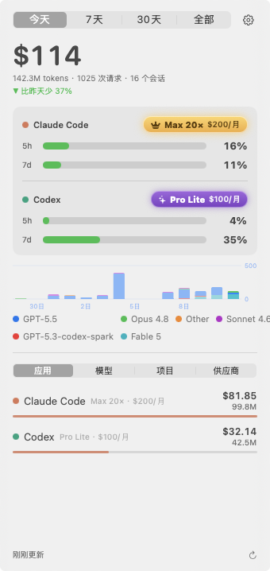
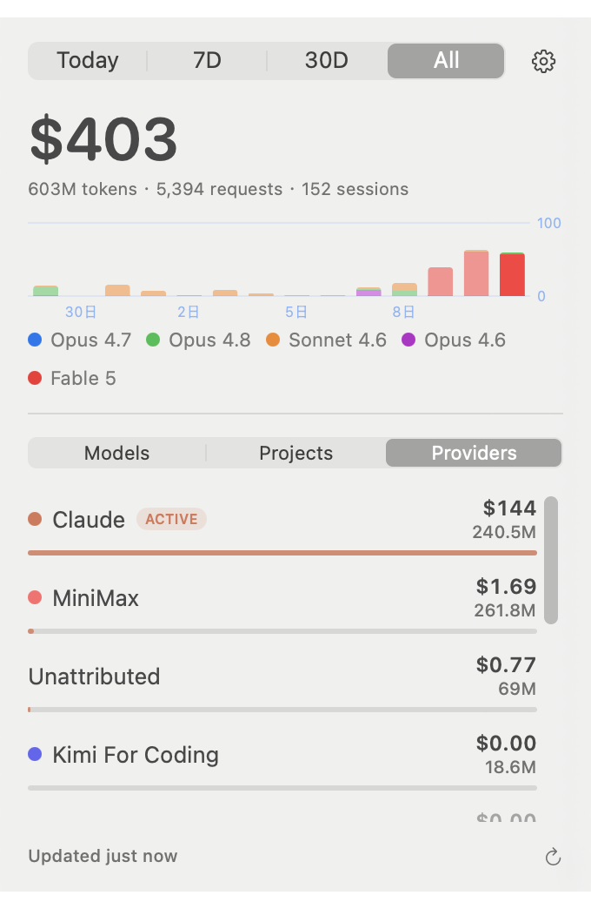

<div align="center">



# Tally

**Claude Code token usage and cost, live in your menu bar.**

[](https://github.com/a77ming/tally/releases)
[](https://swift.org)
[](LICENSE)
[](https://github.com/a77ming/tally/releases/latest)

English · [中文](#简体中文)

&nbsp;&nbsp;

</div>

---

Tally is a 100% native SwiftUI menu bar app for macOS (14+, Apple Silicon & Intel) that shows what your Claude Code and Codex CLI sessions are actually costing you — at a glance, without leaving your desk or running a CLI. Local-first: no accounts, no telemetry.

**Works the moment you install it.** Tally reads the local files Claude Code and Codex already write — usage, cost, model, project, and plan all show up with zero setup. The only thing that asks for permission is Claude's *live* rate-limit gauge: macOS shows one Keychain prompt — click **Always Allow** and it never asks again (Codex limits and all plan badges need no prompt at all).

## Features

- **Menu bar at a glance** — today's spend right in the menu bar. Switch to token count or icon-only if you prefer it quiet.
- **Refined popover** — click to open: a big spend number for the selected period (Today / 7D / 30D / All), a tokens · requests · sessions line, and a "vs yesterday" delta.
- **14-day cost chart** — stacked by model, drawn with Swift Charts.
- **Codex, however you run it** — Tally reads Codex session rollouts from `~/.codex/sessions`, which the **CLI, the VS Code / Cursor extension, and the Codex desktop app all write to**. Your GPT usage and cost are counted no matter which one you use. (Only cloud-run Codex on the web has no local logs.)
- **Subscription quota at a glance** — live 5-hour and weekly rate-limit gauges for both Claude (official subscription) and Codex, right in the Apps tab. Claude quota is fetched from Anthropic's usage endpoint with the credentials Claude Code already stores — Tally's only network call, one toggle to turn off. Codex quota comes from local logs.
- **Ranked plan badge** — your subscription tier and its price sit next to each app as a game-style rank: bronze → silver → amethyst → a crowned gold tier for the \$200 plans. Claude (Free / Pro \$20 / Max 5× \$100 / Max 20× \$200) and Codex/ChatGPT (Free / Go \$8 / Plus \$20 / Pro Lite \$100 / Pro \$200). A quiet flex when you share a screenshot. Tiers read from local files (`~/.claude.json`, `~/.codex/auth.json`) — accurate down to Max 5× vs 20×, no prompt.
- **Bilingual UI** — English / 简体中文 / follow system, switchable in Settings.
- **Four breakdowns**:
  - **Apps** — Claude Code vs Codex side by side, each with live 5h/7d quota gauges.
  - **Models** — spend and tokens per model (Opus, Sonnet, Haiku, GPT, third-party models…).
  - **Projects** — which codebases are burning your budget.
  - **Providers** — if you use [cc-switch](https://github.com/farion1231/cc-switch) to hop between API providers (official Anthropic, MiniMax, Kimi, DeepSeek, relays…), Tally shows per-provider tokens and cost, each with its brand color and the active provider highlighted.
- **Accurate accounting** — reads the apps' own session logs, including cache read/write tokens, with request-id dedup and incremental parsing.
- **Real pricing** — uses cc-switch's 147-model pricing table when available, falling back to a built-in Claude price table. Unknown models still count tokens (priced at $0).
- **Settings** — menu bar display mode, refresh interval (30s / 1m / 5m), launch at login. Auto-refreshes on a timer, with manual refresh anytime.

## Install

1. Download the latest `.dmg` from [Releases](https://github.com/a77ming/tally/releases).
2. Drag **Tally** to **Applications**.
3. First launch: the app is unsigned, so macOS Gatekeeper will object. Either right-click the app → **Open**, or run:

```sh
xattr -cr /Applications/Tally.app
```

## Build from source

Requires only Xcode Command Line Tools — no Xcode, no Apple Developer account.

```sh
git clone https://github.com/a77ming/tally.git
cd tally
./Scripts/build-app.sh   # builds Tally.app
./Scripts/make-dmg.sh    # packages dist/Tally.dmg
```

## How it works

Tally reads three local data sources. Nothing ever leaves your machine.

| Source | What it provides | Required? |
|---|---|---|
| `~/.claude/projects/**/*.jsonl` | Claude Code's session logs: tokens (incl. cache read/write), model, project, session | Yes |
| `~/.codex/sessions/**/*.jsonl` | Codex session rollouts — CLI, VS Code/Cursor extension, and desktop app all write here: GPT tokens (incl. cached input), model, project, rate-limit quota | Optional |
| `~/.cc-switch/cc-switch.db` | cc-switch's provider list, per-provider daily usage rollups, and its 147-model pricing table | Optional |

Without cc-switch, the Providers tab shows a hint and Tally uses its built-in Claude pricing — everything else works the same.

**Privacy:** local-first. The only network call is the optional Claude quota query to Anthropic's own usage endpoint (one toggle to disable); everything else is parsed locally. No accounts, no telemetry.

## FAQ

**Does Tally read my API keys?**
Usage stats come entirely from local `.jsonl` session logs and cc-switch's tables — keys, prompts, and responses are never touched. For the optional Claude quota gauge, Tally reads the OAuth token Claude Code already stores and sends it only to Anthropic's own usage endpoint, nowhere else. Disable it in Settings and Tally makes zero network calls.

**Does it work without cc-switch?**
Yes. You get everything except the per-provider breakdown; the Providers tab simply shows a hint, and built-in Claude pricing is used.

**Why is the app unsigned?**
Tally is free and open source, and signing requires a paid Apple Developer account. You can bypass Gatekeeper with right-click → Open (or the `xattr` one-liner above), or build from source yourself.

**Why don't my costs match my bill exactly?**
Tally computes cost from token counts × published per-model prices. Subscriptions (e.g. Claude Pro/Max), provider-side discounts, or unknown models (counted at $0) can make the real bill differ.

## Acknowledgements

Tally stands on the shoulders of three great projects:

- [ccusage](https://github.com/ryoppippi/ccusage) — the original Claude Code usage analyzer, CLI-first and excellent at it.
- [cc-bar](https://github.com/nanvon/cc-bar) — menu bar quota tracking for Codex accounts.
- [cc-switch](https://github.com/farion1231/cc-switch) — effortless provider switching for Claude Code; Tally happily reads its database to power the Providers tab.

ccusage is CLI-only, cc-bar tracks Codex quota, and cc-switch switches providers without visualizing usage — Tally aims to be the missing piece: a glanceable, multi-provider usage meter with native Apple design.

## License

[MIT](LICENSE) © 2026 a77ming

---

# 简体中文

<div align="center">

**Claude Code 与 Codex CLI 的 token 用量与花费，实时显示在菜单栏。**

</div>

Tally 是一款 100% 原生 SwiftUI 的 macOS 菜单栏应用（macOS 14+，Apple Silicon 与 Intel 均支持），让你一眼看清 Claude Code 和 Codex CLI 到底花了多少钱——不用开终端、不用跑 CLI。本地优先：无账号、无遥测。

**装上即用，无需配置。** Tally 直接读取 Claude Code 和 Codex 本身写在本地的文件——用量、花费、模型、项目、套餐档位全部零配置显示。唯一需要授权的是 Claude 的*实时*限额进度条：macOS 会弹一次钥匙串授权框，点“始终允许”后永不再问（Codex 限额和所有套餐徽章完全无需授权）。

## 功能

- **菜单栏一目了然** — 今日花费直接显示在菜单栏，也可切换为 token 数或纯图标模式。
- **精致的弹出面板** — 点击展开：所选周期（今天 / 7天 / 30天 / 全部）的大号金额数字、tokens · 请求数 · 会话数一行摘要、以及"对比昨天"的变化量。
- **14 天费用图表** — 按模型堆叠，由 Swift Charts 绘制。
- **Codex 全形态支持** — Tally 读取 `~/.codex/sessions` 会话日志，而 **Codex CLI、VS Code / Cursor 扩展、Codex 桌面 app 都会写入这里**，所以无论你用哪种方式跑 Codex，GPT 用量和花费都能统计到。（只有网页端的云端 Codex 没有本地日志。）
- **订阅限额一目了然** — Claude（官方订阅）与 Codex 的 5 小时 / 每周限额进度条，直接显示在"应用"标签页。Claude 限额使用 Claude Code 已保存的凭证查询 Anthropic 官方用量接口——这是 Tally 唯一的网络请求，一个开关即可关闭；Codex 限额来自本地日志。
- **段位套餐徽章** — 每个 App 旁边以游戏段位风格展示你的订阅档位与价格：青铜 → 白银 → 紫晶 → \$200 档位的金冠王者。Claude（免费 / Pro \$20 / Max 5× \$100 / Max 20× \$200）和 Codex/ChatGPT（免费 / Go \$8 / Plus \$20 / Pro Lite \$100 / Pro \$200）。分享截图时无形展示财力。档位读取本地文件（`~/.claude.json`、`~/.codex/auth.json`），精确区分 Max 5× 与 20×，无需授权。
- **双语界面** — English / 简体中文 / 跟随系统，设置中随时切换。
- **四种维度拆分**：
  - **应用** — Claude Code 与 Codex 并列对比，各自带实时 5h/7d 限额进度条。
  - **模型** — 每个模型（Opus、Sonnet、Haiku、GPT、第三方模型……）的花费与 token 数。
  - **项目** — 哪些代码库在消耗你的预算。
  - **供应商** — 如果你使用 [cc-switch](https://github.com/farion1231/cc-switch) 在多个 API 供应商之间切换（Anthropic 官方、MiniMax、Kimi、DeepSeek、中转站……），Tally 会按供应商展示 token 与费用，每个供应商带品牌色，当前激活的供应商高亮显示。
- **精确统计** — 直接读取应用自身的会话日志，包含缓存读/写 token，按 request-id 去重，增量解析。
- **真实定价** — 优先使用 cc-switch 的 147 个模型定价表，无 cc-switch 时回退到内置 Claude 价格表。未知模型仍统计 token（按 $0 计价）。
- **设置** — 菜单栏显示模式、刷新间隔（30 秒 / 1 分钟 / 5 分钟）、开机自启。定时自动刷新，也可随时手动刷新。

## 安装

1. 从 [Releases](https://github.com/a77ming/tally/releases) 下载最新的 `.dmg`。
2. 把 **Tally** 拖进 **应用程序** 文件夹。
3. 首次启动：应用未签名，macOS Gatekeeper 会拦截。右键点击应用 → **打开**，或执行：

```sh
xattr -cr /Applications/Tally.app
```

## 从源码构建

只需要 Xcode Command Line Tools——不需要完整 Xcode，也不需要 Apple 开发者账号。

```sh
git clone https://github.com/a77ming/tally.git
cd tally
./Scripts/build-app.sh   # 构建 Tally.app
./Scripts/make-dmg.sh    # 打包 dist/Tally.dmg
```

## 工作原理

Tally 只读取三个本地数据源，任何数据都不会离开你的电脑。

| 数据源 | 提供什么 | 是否必需 |
|---|---|---|
| `~/.claude/projects/**/*.jsonl` | Claude Code 的会话日志：token（含缓存读/写）、模型、项目、会话 | 必需 |
| `~/.codex/sessions/**/*.jsonl` | Codex 会话日志——CLI、VS Code/Cursor 扩展、桌面 app 都写入此处：GPT token（含缓存输入）、模型、项目、限额配额 | 可选 |
| `~/.cc-switch/cc-switch.db` | cc-switch 的供应商列表、各供应商每日用量汇总、147 个模型的定价表 | 可选 |

没有 cc-switch 时，"供应商"标签页会显示提示，并使用内置 Claude 定价——其余功能完全一致。

**隐私：** 本地优先。唯一的网络请求是可选的 Claude 限额查询（访问 Anthropic 官方用量接口，一个开关即可关闭），其余全部本地解析。无账号、无遥测。

## 常见问题

**Tally 会读取我的 API Key 吗？**
用量统计完全来自本地 `.jsonl` 会话日志和 cc-switch 数据表——Key、提示词和模型回复都不会被读取。可选的 Claude 限额功能会读取 Claude Code 已保存的 OAuth 凭证，且只发送给 Anthropic 官方用量接口。在设置中关闭后，Tally 零网络请求。

**不装 cc-switch 能用吗？**
能。除了按供应商拆分之外，其余功能全部可用；"供应商"标签页只会显示一条提示，定价使用内置 Claude 价格表。

**为什么应用没有签名？**
Tally 免费开源，而签名需要付费的 Apple 开发者账号。你可以通过右键 → 打开（或上面的 `xattr` 命令）绕过 Gatekeeper，也可以自己从源码构建。

**为什么费用和实际账单对不上？**
Tally 用 token 数 × 各模型公开单价计算费用。订阅套餐（如 Claude Pro/Max）、供应商折扣、或未知模型（按 $0 计）都可能导致与真实账单存在差异。

## 致谢

Tally 站在三个优秀项目的肩膀上：

- [ccusage](https://github.com/ryoppippi/ccusage) — 最早的 Claude Code 用量分析工具，CLI 形态且非常出色。
- [cc-bar](https://github.com/nanvon/cc-bar) — Codex 账号配额的菜单栏监控。
- [cc-switch](https://github.com/farion1231/cc-switch) — Claude Code 供应商一键切换；Tally 的"供应商"标签页正是基于它的数据库。

ccusage 只有 CLI，cc-bar 监控的是 Codex 配额，cc-switch 负责切换但不做用量可视化——Tally 想补上缺失的一块：一个原生苹果设计、支持多供应商、抬眼即见的用量仪表。

## 许可证

[MIT](LICENSE) © 2026 a77ming
